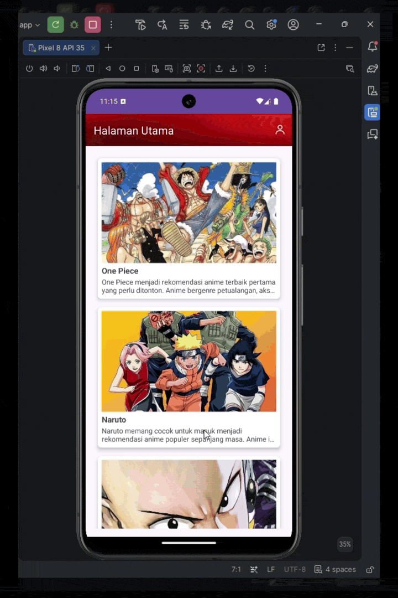

# Simple Android Application — Dicoding Submission

## About 
This project is a simple Android application developed as part of a Dicoding certification program. The submission allowed me to choose a project theme freely while implementing several fundamental Android development concepts.

The application demonstrates the implementation of Activity, Intent, View and ViewGroup, Style and Theme, and RecyclerView to build a functional Android application.

## Tech Stack

| Category	| Technology |
| -------- | ------- | 
| Language	| Kotlin |
| Platform	| Android Studio |
| UI Components	| Android Views & RecyclerView |
